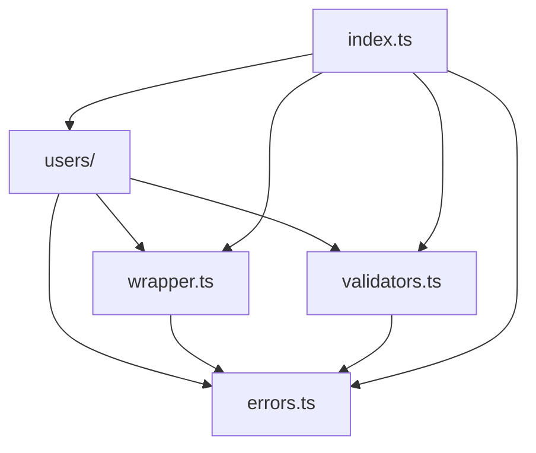

# @myorg/api

🚀 **Shared API Client for Monorepo Applications**

A centralized, type-safe API client designed to be shared across all applications in this monorepo. Whether you're building a React web app, React Native mobile app, or any other frontend application, this package provides a consistent and robust API layer.

## ✨ Features

- 🛡️ **Type Safety**: Strict TypeScript with Zod validation
- 🎯 **Robust Error Handling**: Result<T> pattern to avoid unhandled exceptions
- 🔍 **Automatic Validation**: All data validated on the client side
- 📊 **Complete RESTful API**: CRUD operations for users and extensible for other resources
- 🏗️ **Modular Architecture**: Organized and reusable code
- ⚡ **Performance**: Optimized HTTP request handling
- 🔒 **Security**: Parameter validation and injection protection
- 🔄 **Cross-Platform**: Works seamlessly across React, React Native, Astro, and more

## 🏢 Monorepo Usage

This package is designed specifically for internal use within this monorepo. It's automatically available to all applications without publishing to npm.

### In React Applications

```bash
# From your React app directory
cd apps/my-react-app
```

```typescript
// Tree-shakeable import for optimal bundle size
import { usersApi } from '@myorg/api/users'
import { WrapperError } from '@myorg/api/errors'
```

### In React Native Applications

```bash
# From your React Native app directory
cd apps/my-react-native-app
```

```typescript
// Same tree-shakeable imports work in React Native
import { usersApi } from '@myorg/api/users'
import { createWrapper } from '@myorg/api/wrapper'
```

### In Astro Applications

```bash
# From your Astro app directory
cd apps/simple-website
```

```typescript
// Tree-shakeable imports work in server-side rendering
import { usersApi } from '@myorg/api/users'
import { checkEmail } from '@myorg/api/validators'
```

## 🎯 Basic Usage

### Tree-Shakeable Imports

The package is fully tree-shakeable, allowing you to import only what you need for optimal bundle size:

```typescript
// Import everything (not recommended for production)
import { usersApi, createWrapper, WrapperError } from '@myorg/api'

// Tree-shaking: Import only users API (recommended)
import { usersApi } from '@myorg/api/users'

// Tree-shaking: Import only wrapper utilities
import {
  createWrapper,
  fetchAndValidate,
  safeRequest,
} from '@myorg/api/wrapper'

// Tree-shaking: Import only error handling
import { WrapperError, createSuccess, createError } from '@myorg/api/errors'

// Tree-shaking: Import only validators
import { checkId, checkEmail, checkSchema } from '@myorg/api/validators'
```

### Available Modules

| Module         | Path                    | Exports                                                         | Use Case              |
| -------------- | ----------------------- | --------------------------------------------------------------- | --------------------- |
| **Main**       | `@myorg/api`            | All exports                                                     | Complete API access   |
| **Users**      | `@myorg/api/users`      | `usersApi`, `User`, `UserSchema`                                | User management only  |
| **Wrapper**    | `@myorg/api/wrapper`    | `createWrapper`, `fetchAndValidate`, `safeRequest`              | HTTP client utilities |
| **Errors**     | `@myorg/api/errors`     | `WrapperError`, `createSuccess`, `createError`, `WrapperResult` | Error handling        |
| **Validators** | `@myorg/api/validators` | `checkId`, `checkEmail`, `checkSchema`                          | Input validation      |

### Result<T> Pattern

All methods return a tuple `[isSuccess, data, error]`:

```typescript
const [isSuccess, data, error] = await usersApi.all()

if (isSuccess) {
  // ✅ Success: data is automatically typed, error is null
  console.log('Users:', data) // data is User[], no need to check null
  data.forEach((user) => console.log(user.name)) // Full autocompletion
} else {
  // ❌ Error: data is null, error contains details
  console.error('Error:', error.message, error.code, error.status)
}
```

### Tree-Shaking Benefits

🌟 **Why use tree-shakeable imports?**

- 📦 **Smaller bundles**: Only include the code you actually use
- ⚡ **Faster loading**: Less JavaScript to download and parse
- 🎯 **Better performance**: Reduced memory footprint
- 🔍 **Clear dependencies**: Explicit about what your code uses

```typescript
// ❌ Not optimal: Imports entire API package (users, wrapper, errors, validators)
import { usersApi } from '@myorg/api'

// ✅ Optimal: Only imports user-related code
import { usersApi } from '@myorg/api/users'

// ✅ Even more granular: Mix and match as needed
import { usersApi } from '@myorg/api/users'
import { createWrapper } from '@myorg/api/wrapper'
import { checkEmail } from '@myorg/api/validators'
```

### Authentication Support

```typescript
// Tree-shakeable import for wrapper utilities
import {
  createWrapper,
  fetchAndValidate,
  safeRequest,
} from '@myorg/api/wrapper'
import { UserSchema } from '@myorg/api/users'

// Create authenticated wrapper for secure APIs
const authUsersApi = createWrapper('https://api.example.com/users').auth(
  'your-api-key',
)

// Use with existing patterns
const [isSuccess, users, error] = await safeRequest(() =>
  fetchAndValidate(authUsersApi.get(), UserSchema),
)
```

### Custom API Wrapper Example

```typescript
// Only import what you need for a custom API
import {
  createWrapper,
  fetchAndValidate,
  safeRequest,
} from '@myorg/api/wrapper'
import { WrapperError, type WrapperResult } from '@myorg/api/errors'
import { checkSchema } from '@myorg/api/validators'
import { z } from 'zod'

// Define your own schema
const ProductSchema = z.object({
  id: z.number(),
  name: z.string(),
  price: z.number(),
})

// Create custom API client
const productsWrapper = createWrapper('https://api.mystore.com/products')

export const productsApi = {
  all: (): Promise<WrapperResult<z.infer<typeof ProductSchema>[]>> =>
    safeRequest(() =>
      fetchAndValidate(productsWrapper.get(), z.array(ProductSchema)),
    ),

  get: (id: number): Promise<WrapperResult<z.infer<typeof ProductSchema>>> =>
    safeRequest(() =>
      fetchAndValidate(productsWrapper.url(`/${id}`).get(), ProductSchema),
    ),
}
```

## 📚 API Reference

### 👥 Users API

#### `usersApi.all()`

Retrieves all users.

```typescript
const [isSuccess, usersList, error] = await usersApi.all()

if (isSuccess) {
  console.log(`${usersList.length} users loaded`)
  usersList.forEach((user) => console.log(user.name)) // usersList is always User[]
} else {
  console.error('Loading error:', error.message)
}
```

**Returns:** `Promise<WrapperResult<User[]>>`

---

#### `usersApi.get(id)`

Retrieves a user by ID.

```typescript
const [isSuccess, user, error] = await usersApi.get(1)

if (!isSuccess && error?.status === 404) {
  console.log('User not found')
} else if (!isSuccess) {
  console.error('Error:', error.message)
} else {
  console.log('User:', user.name)
}
```

**Parameters:**

- `id` (number): User ID (positive integer)

**Returns:** `Promise<WrapperResult<User>>`

**Possible errors:**

- `400`: Invalid ID
- `404`: User not found

---

#### `usersApi.findByEmail(email)`

Searches for users by email.

```typescript
const [isSuccess, users, error] = await usersApi.findByEmail('john@example.com')

if (isSuccess) {
  console.log(`${users.length} user(s) found`)
}
```

**Parameters:**

- `email` (string): Email address to search for

**Returns:** `Promise<WrapperResult<User[]>>`

**Possible errors:**

- `400`: Invalid email format

---

#### `usersApi.create(userData)`

Creates a new user.

```typescript
const newUser = {
  name: 'John Doe',
  username: 'johndoe',
  email: 'john@example.com',
  // ... other required properties
}

const [isSuccess, createdUser, error] = await usersApi.create(newUser)

if (isSuccess) {
  console.log('User created with ID:', createdUser.id)
}
```

**Parameters:**

- `userData` (Omit<User, 'id'>): User data (without ID)

**Returns:** `Promise<WrapperResult<User>>`

---

#### `usersApi.update(id, updates)`

Updates an existing user.

```typescript
const updates = {
  name: 'Jane Doe',
  email: 'jane@example.com',
}

const [isSuccess, updatedUser, error] = await usersApi.update(1, updates)

if (isSuccess) {
  console.log('User updated:', updatedUser.name)
}
```

**Parameters:**

- `id` (number): User ID
- `updates` (Partial<User>): Data to update

**Returns:** `Promise<WrapperResult<User>>`

**Possible errors:**

- `400`: Invalid ID or invalid data
- `404`: User not found

---

#### `usersApi.delete(id)`

Deletes a user.

```typescript
const [isSuccess, , error] = await usersApi.delete(1)

if (!isSuccess && error?.status === 404) {
  console.log('User already deleted')
} else if (!isSuccess) {
  console.error('Deletion error:', error.message)
} else {
  console.log('User successfully deleted')
}
```

**Parameters:**

- `id` (number): User ID to delete

**Returns:** `Promise<WrapperResult<void>>`

**Possible errors:**

- `400`: Invalid ID
- `404`: User not found

## 🏗️ Types

### User

```typescript
interface User {
  id: number
  name: string
  username: string
  email: string
  address: {
    street: string
    suite: string
    city: string
    zipcode: string
    geo: {
      lat: string
      lng: string
    }
  }
  phone: string
  website: string
  company: {
    name: string
    catchPhrase: string
    bs: string
  }
}
```

### WrapperResult<T>

```typescript
type WrapperResult<T> =
  | [true, T, null] // Success: data available and typed
  | [false, null, WrapperError] // Error: detailed error available
```

### WrapperError

```typescript
class WrapperError extends Error {
  status: number // HTTP status code
  code?: string // Specific error code
  details?: unknown // Additional details
}
```

## 🚦 Error Handling

### HTTP Error Codes

| Code  | Description           | Example                      |
| ----- | --------------------- | ---------------------------- |
| `400` | Bad Request           | Negative ID, malformed email |
| `401` | Unauthorized          | Missing/invalid token        |
| `403` | Forbidden             | Insufficient permissions     |
| `404` | Not Found             | Non-existent user            |
| `408` | Request Timeout       | Request too slow             |
| `422` | Validation Error      | Invalid Zod data             |
| `500` | Internal Server Error | API-side problem             |
| `0`   | Network Error         | No connection                |

### Custom Error Codes

| Code               | Description            |
| ------------------ | ---------------------- |
| `INVALID_ID`       | Invalid user ID        |
| `INVALID_EMAIL`    | Invalid email format   |
| `INVALID_DATA`     | Data validation failed |
| `VALIDATION_ERROR` | Zod validation error   |
| `NETWORK_ERROR`    | Network error          |

### Complete Error Handling Example

```typescript
const [isSuccess, user, error] = await usersApi.get(userId)

if (!isSuccess) {
  switch (error.code) {
    case 'INVALID_ID':
      console.error('Invalid user ID')
      break
    case 'NETWORK_ERROR':
      console.error('Connection problem, please try again')
      break
    default:
      if (error.status === 404) {
        console.error('User not found')
      } else {
        console.error('Unexpected error:', error.message)
      }
  }
} else {
  // Process data
  console.log('User loaded:', user.name)
}
```

## 🎨 Tree-Shaking Usage Examples

### Scenario 1: User Management Only

If your app only needs user management, import just the users module:

```typescript
// Minimal import - only users functionality
import { usersApi, type User } from '@myorg/api/users'

// Your bundle only includes:
// - Users API methods
// - User schema and types
// - Required dependencies (wrapper, errors, validators)
// ❌ Excludes: Other unused modules

async function loadUser(id: number) {
  const [isSuccess, user, error] = await usersApi.get(id)
  return isSuccess ? user : null
}
```

### Scenario 2: Custom API Wrapper

For building your own API client, import only wrapper utilities:

```typescript
// Only import HTTP utilities
import {
  createWrapper,
  fetchAndValidate,
  safeRequest,
} from '@myorg/api/wrapper'
import { type WrapperResult } from '@myorg/api/errors'

// Your bundle only includes:
// - HTTP wrapper utilities
// - Error handling
// ❌ Excludes: Users API, validators

const customApi = createWrapper('https://api.example.com')
```

### Scenario 3: Input Validation Only

For apps that only need validation utilities:

```typescript
// Only import validation functions
import { checkId, checkEmail, checkSchema } from '@myorg/api/validators'

// Your bundle only includes:
// - Validation functions
// - Error classes (for validation errors)
// ❌ Excludes: HTTP wrapper, users API

function validateUserInput(email: string, id: number) {
  const emailResult = checkEmail(email)
  const idResult = checkId(id)
  return emailResult.isSuccess && idResult.isSuccess
}
```

### Scenario 4: Error Handling Utilities

For apps that need custom error handling:

```typescript
// Only import error utilities
import {
  WrapperError,
  createSuccess,
  createError,
  type WrapperResult,
} from '@myorg/api/errors'

// Your bundle only includes:
// - Error classes and helpers
// - Result type definitions
// ❌ Excludes: HTTP client, users API, validators

function processApiResponse<T>(data: T): WrapperResult<T> {
  try {
    // Process data
    return createSuccess(data)
  } catch (err) {
    return createError(new WrapperError('Processing failed', 500))
  }
}
```

## 🎨 Full Application Examples

### In a React Application

```tsx
// Tree-shakeable import for optimal bundle size
import { usersApi } from '@myorg/api/users'
import { WrapperError } from '@myorg/api/errors'
import { useEffect, useState } from 'react'

function UsersList() {
  const [usersList, setUsersList] = useState([])
  const [error, setError] = useState(null)
  const [loading, setLoading] = useState(true)

  useEffect(() => {
    async function loadUsers() {
      const [isSuccess, data, err] = await usersApi.all()

      if (!isSuccess) {
        setError(err)
      } else {
        setUsersList(data)
      }
      setLoading(false)
    }

    loadUsers()
  }, [])

  if (loading) return <div>Loading...</div>
  if (error) return <div>Error: {error.message}</div>

  return (
    <ul>
      {usersList.map((user) => (
        <li key={user.id}>
          {user.name} - {user.email}
        </li>
      ))}
    </ul>
  )
}
```

### In a React Native Application

```tsx
// Tree-shakeable imports are optimal for mobile bundle size
import { usersApi } from '@myorg/api/users'
import { WrapperError } from '@myorg/api/errors'
import { useEffect, useState } from 'react'
import { View, Text, FlatList, ActivityIndicator } from 'react-native'

function UsersScreen() {
  const [usersList, setUsersList] = useState([])
  const [error, setError] = useState(null)
  const [loading, setLoading] = useState(true)

  useEffect(() => {
    async function loadUsers() {
      const [isSuccess, data, err] = await usersApi.all()

      if (!isSuccess) {
        setError(err)
      } else {
        setUsersList(data)
      }
      setLoading(false)
    }

    loadUsers()
  }, [])

  if (loading) return <ActivityIndicator size='large' />
  if (error) return <Text>Error: {error.message}</Text>

  return (
    <FlatList
      data={usersList}
      keyExtractor={(user) => user.id.toString()}
      renderItem={({ item: user }) => (
        <View>
          <Text>{user.name}</Text>
          <Text>{user.email}</Text>
        </View>
      )}
    />
  )
}
```

### In an Astro Application

```astro
---
// Tree-shakeable imports for server-side rendering
import { usersApi } from '@myorg/api/users'

const [usersSuccess, usersList, usersError] = await usersApi.all()
const [userSuccess, user, userError] = await usersApi.get(1)
---

<div>
  {
    !usersSuccess ? (
      <p>Error: {usersError.message}</p>
    ) : (
      <ul>
        {usersList.map((user) => (
          <li>{user.name}</li>
        ))}
      </ul>
    )
  }

  {
    !userSuccess ? (
      <p>User not found</p>
    ) : (
      user && (
        <div>
          <h2>{user.name}</h2>
          <p>{user.email}</p>
        </div>
      )
    )
  }
</div>
```

## 🏭 Architecture

```bash
packages/api/src/
├── index.ts          # Main entry point (re-exports all modules)
├── errors.ts         # 🌳 Tree-shakeable: Error classes and Result types
├── validators.ts     # 🌳 Tree-shakeable: Input validation functions
├── wrapper.ts        # 🌳 Tree-shakeable: HTTP client utilities
└── users/            # 🌳 Tree-shakeable: User resource module
    ├── index.ts      # Users API methods
    └── schemas.ts    # Zod schemas and TypeScript types
```

### Tree-Shaking Architecture

Each module is designed to be independently importable:

| Module            | Tree-shakeable Path     | Dependencies                      | Bundle Impact |
| ----------------- | ----------------------- | --------------------------------- | ------------- |
| 🗂️ **Main**       | `@myorg/api`            | All modules                       | Full package  |
| 🚨 **Errors**     | `@myorg/api/errors`     | None                              | Minimal       |
| ✅ **Validators** | `@myorg/api/validators` | `errors`                          | Small         |
| 🌐 **Wrapper**    | `@myorg/api/wrapper`    | `errors`                          | Medium        |
| 👥 **Users**      | `@myorg/api/users`      | `wrapper`, `errors`, `validators` | Medium-Large  |

### Dependency Graph



### Key Concepts

- **🌳 Tree-Shakeable**: Each module can be imported independently
- **📦 Zero Waste**: Import only what you need for optimal bundle size
- **🚨 Errors**: Centralized error handling with WrapperError class and Result types
- **✅ Validators**: Input validation utilities for IDs, emails, and schemas
- **🌐 Wrapper**: Abstraction around Wretch for HTTP handling
- **🔒 Safe Request**: Pattern that transforms exceptions into Result tuples
- **🛡️ Validation**: All data passes through Zod schemas
- **🏗️ Modularity**: Each resource (users) is in its own module
- **🌍 Cross-Platform**: Same API works across React, React Native, Astro, etc.

### Bundle Size Optimization

```typescript
// ❌ Large bundle: Imports everything (~15KB minified)
import { usersApi } from '@myorg/api'

// ✅ Optimal bundle: Only users functionality (~8KB minified)
import { usersApi } from '@myorg/api/users'

// ✅ Minimal bundle: Only validation (~2KB minified)
import { checkEmail } from '@myorg/api/validators'

// ✅ Custom mix: Exactly what you need (~5KB minified)
import { createWrapper } from '@myorg/api/wrapper'
import { WrapperError } from '@myorg/api/errors'
```

## 🛠️ Development

### Available Scripts

```bash
# Build the package
pnpm build

# Run tests
pnpm test

# Type checking
pnpm typecheck

# Run tests with coverage
pnpm test --coverage
```

### Adding a New Resource

1. Create the `src/posts/` folder
2. Add `schemas.ts` with Zod types
3. Create `index.ts` with the API
4. Export from `src/index.ts`
5. **Update package.json exports for tree-shaking**

```typescript
// src/posts/schemas.ts
import { z } from 'zod'

export const PostSchema = z.object({
  id: z.number(),
  title: z.string(),
  content: z.string(),
  // ... other fields
})

export type Post = z.infer<typeof PostSchema>

// src/posts/index.ts
import { createWrapper, fetchAndValidate, safeRequest } from '../wrapper'
import { type WrapperResult } from '../errors'
import { PostSchema } from './schemas'

const postsWrapper = createWrapper('https://jsonplaceholder.typicode.com/posts')

export const postsApi = {
  all: (): Promise<WrapperResult<Post[]>> =>
    safeRequest(() =>
      fetchAndValidate(postsWrapper.get(), z.array(PostSchema)),
    ),
  // ... other methods
}

// src/index.ts
export * from './posts'
```

**5. Update package.json for tree-shaking support:**

```json
{
  "exports": {
    ".": "./src/index.ts",
    "./posts": "./src/posts/index.ts"
    // ... other exports
  },
  "publishConfig": {
    "exports": {
      "./posts": {
        "import": "./dist/posts/index.js",
        "require": "./dist/posts/index.cjs",
        "types": "./dist/posts/index.d.ts"
      }
    }
  }
}
```

Now users can import posts with tree-shaking:

```typescript
// Tree-shakeable import
import { postsApi } from '@myorg/api/posts'
```

## 🚀 Monorepo Integration

### Workspace Dependencies

This package is configured as a workspace dependency and is automatically available to all apps:

```json
// In any app's package.json
{
  "dependencies": {
    "@myorg/api": "workspace:*"
  }
}
```

### Tree-Shaking in Production Builds

Each app can optimize its bundle by importing only needed modules:

```typescript
// React app: Only needs user management
import { usersApi } from '@myorg/api/users'

// Admin dashboard: Needs users + custom wrappers
import { usersApi } from '@myorg/api/users'
import { createWrapper } from '@myorg/api/wrapper'

// Validation service: Only needs validators
import { checkEmail, checkId } from '@myorg/api/validators'

// Error boundary: Only needs error handling
import { WrapperError } from '@myorg/api/errors'
```

### Development Workflow

1. **Make changes** to the API package
2. **Test locally** using `pnpm test`
3. **Use immediately** in any app - no build step required for development
4. **Optimize imports** using tree-shakeable paths
5. **Build for production** with automatic dead code elimination

### Bundle Analysis Example

```bash
# Analyze your app's bundle to see tree-shaking impact
cd apps/my-react-app
pnpm build
pnpm bundle-analyzer

# Results might show:
# ✅ @myorg/api/users: 8.2KB (used)
# ❌ @myorg/api/wrapper: 0KB (tree-shaken out)
# ❌ @myorg/api/validators: 0KB (tree-shaken out)
```

### Consistent API Across Platforms

Whether you're building for web, mobile, or server-side rendering, the tree-shakeable API remains exactly the same:

```typescript
// Same tree-shakeable imports everywhere
import { usersApi } from '@myorg/api/users'
import { WrapperError } from '@myorg/api/errors'

// Same methods everywhere
const [isSuccess, users, error] = await usersApi.all()

// Same error handling everywhere
if (!isSuccess) {
  console.error('API Error:', error.code, error.message)
}
```

### Framework-Specific Optimizations

#### Vite (React, Vue, Svelte)

```typescript
// Vite automatically tree-shakes unused exports
import { usersApi } from '@myorg/api/users' // ✅ Only users code included
```

#### Next.js

```typescript
// Next.js optimizes both client and server bundles
import { usersApi } from '@myorg/api/users' // ✅ Works in SSR + client
```

#### React Native / Expo

```typescript
// Metro bundler supports tree-shaking with proper exports
import { usersApi } from '@myorg/api/users' // ✅ Minimal mobile bundle
```

#### Astro

```typescript
// Astro tree-shakes both SSR and client-side hydration
import { usersApi } from '@myorg/api/users' // ✅ Optimal for SSG/SSR
```

## 📄 License

MIT

---

**🎯 Built for optimal developer experience with maximum type safety across the monorepo!**
